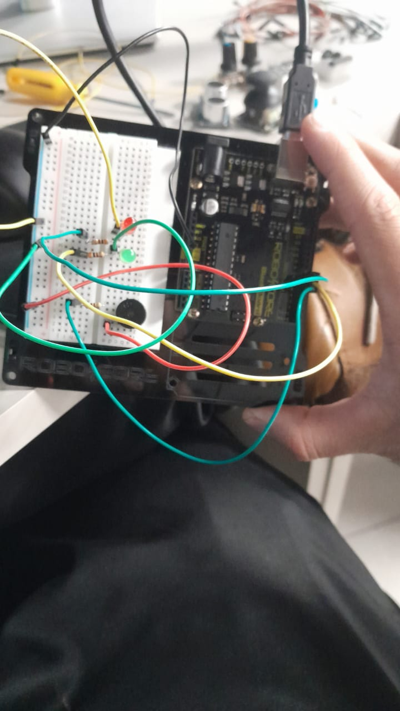

# Giroflex Policial - Projeto de Sistemas Embarcados

Descrição
---------
Projeto simples que simula um giroflex policial usando dois LEDs e um buzzer. LEDs alternam rapidamente e o buzzer toca uma sirene com sweep (sobe e desce).

Componentes
----------
- Arduino Uno (ou compatível)
- 2 x LEDs (qualquer cor)
- 2 x resistores 220Ω
- 1 x Buzzer passivo (ou ativo)
- Fios e breadboard

Ligação
------
- LED1: D3 -> resistor 220Ω -> anodo LED -> catodo -> GND
- LED2: D4 -> resistor 220Ω -> anodo LED -> catodo -> GND
- Buzzer: D5 -> + do buzzer; - do buzzer -> GND
- GND comum para todos os componentes

Código
-----
Arquivo: `giroflex.ino`  
(Carregue no Arduino usando o IDE Arduino)

Uso
---
1. Monte o circuito conforme a seção "Ligação".
2. Abra o `giroflex.ino` no Arduino IDE.
3. Selecione a placa e porta corretas e faça upload.
4. Observe os LEDs alternando e a sirene tocando.

Foto
----
  <!-- substitua por sua foto real no repositório -->

Autor
-----
Nickolas
